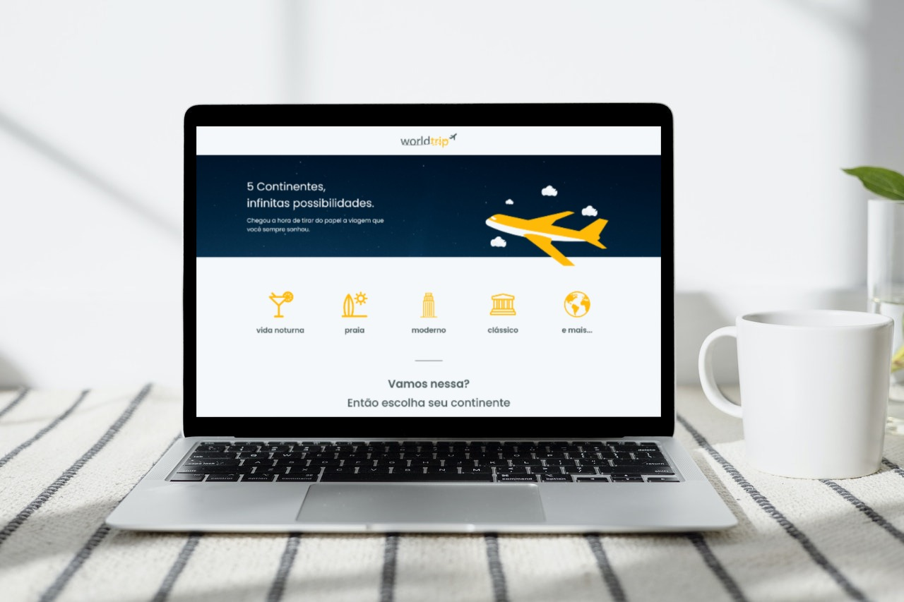

# ✈️ World Trip

  

### Projeto criado no treinamento Ignite da Rocketseat

## ➡️ Sobre 
O projeto possui dois ojetivos principais. O primeiro é desenvolver toda a interface usando como base o Chakra UI. O outro é trabalhar o responsivo da aplicação.

A aplicação foi desenvolvida do zero utilizando typescript com o Chakra UI, Next.js e o Swiper, para o slider de continentes. Fique à vontade para navegar no projeto! :)

### Ver projetos: 

)

## 🚀 Tecnologias 
-   [x] Next.js com SSG
-   [x] Chakra UI
-   [x] Swiper
-   [x] Typescript
-   [x] CSS Animations
